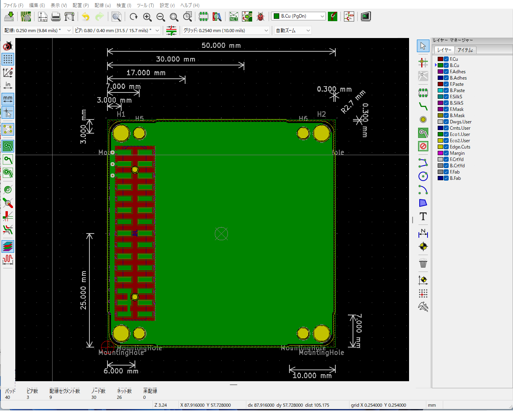

# KiCad-Template-M5Stack-FDM-Bottom
a PCB template of FDM-bottoms of M5Stack with footprints for KiCad.
## for KiCad 6
https://github.com/botanicfields/KiCad6-Environment

## for KiCad 5
- FDM: Fused Deposition Modeling
- Manufacture with a thickness of 1.0 mm.
- M-BUS pin numbers match pin headers and pin sockets in the KiCad library.

